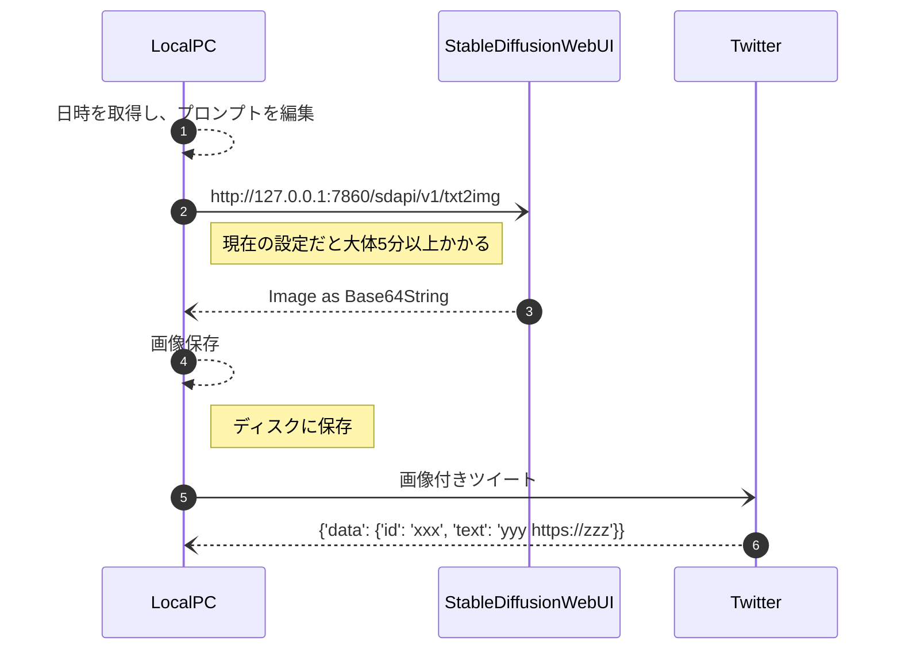

# Stable-Diffusion-Webui-Client

## 概要
### callapi_txt2image.py
- ローカルに立てたautomatic1111/stable_diffution_webuiのWebAPIのtext2imageを使用し、画像をツイートする
- cronを使用して例えば1時間に一度ツイートする
```
0 * * * * path/to/dir/callapi_txt2image.py > sd.log 2>&1 &
```




